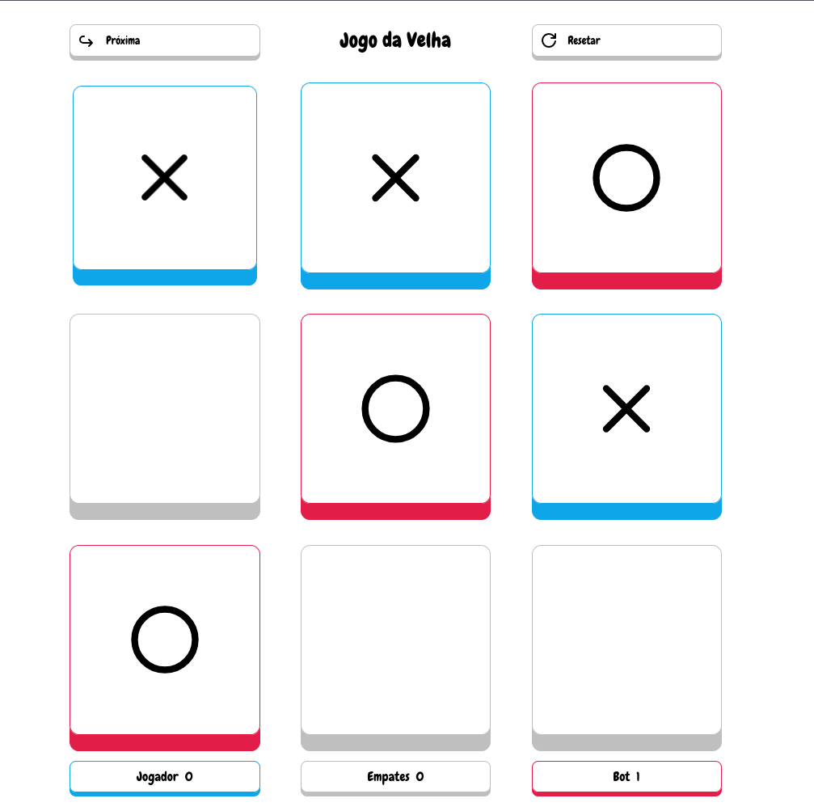
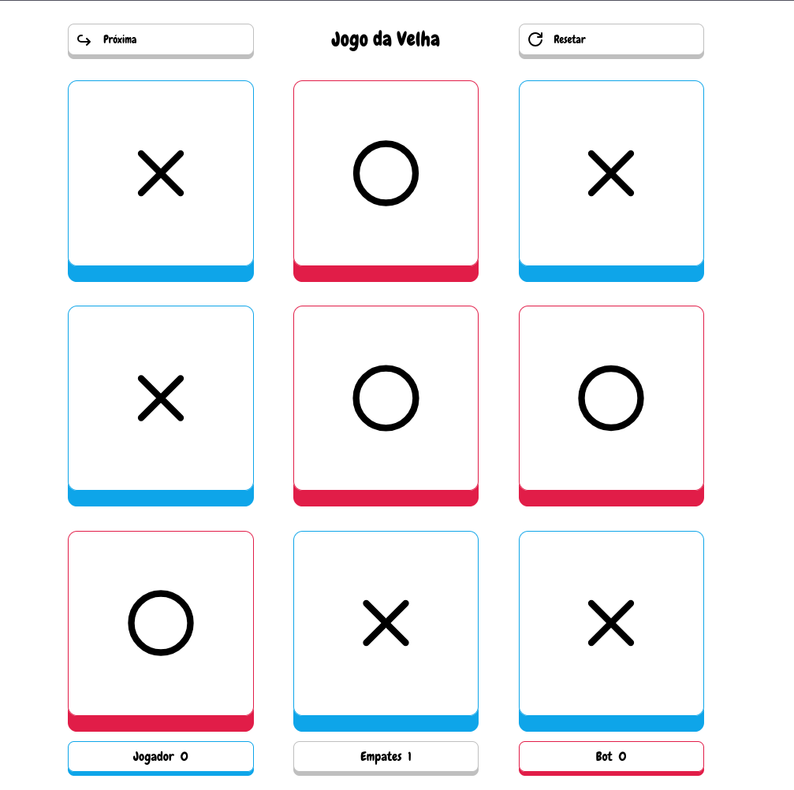

[HTML_BADGE]: https://img.shields.io/badge/HTML-000?style=for-the-badge&logo=html5&logoColor=white
[CSS_BADGE]: https://img.shields.io/badge/CSS-000?style=for-the-badge&logo=css3&logoColor=white
[JAVASCRIPT__BADGE]: https://img.shields.io/badge/Javascript-000?style=for-the-badge&logo=javascript&logoColor=white

# Jogo da Velha

![html][HTML_BADGE]
![css][CSS_BADGE]
![javascript][JAVASCRIPT__BADGE]

Um **Jogo da Velha** feito com tecnologias web aplicando conceitos de Programação Orientada a Objetos (POO) e imutabilidade.

👉 Créditos ao professor **Leornado Leitão (Cod3r)**, foi a partir de um projeto proposto por ele que decidi reecriá-lo adaptando-o para utilizar apenas tecnologias web e vanilla.

## Demonstração 1 - Derrota

## Demonstração 2 - Empate

